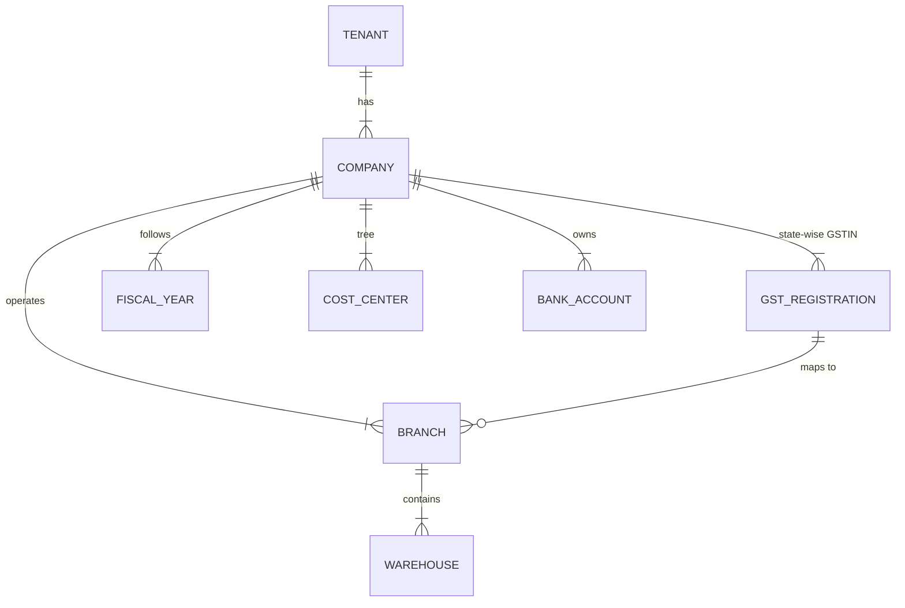
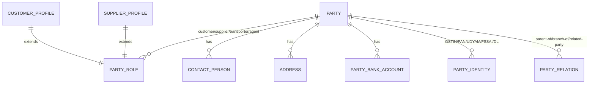
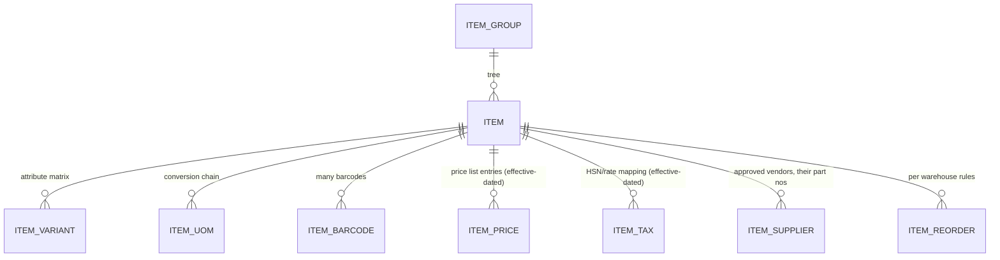

# Core Entities: Org, Party, Catalog

## 1. Org spine

`company`: legal_name, PAN, CIN/LLPIN, entity_type (proprietorship/partnership/LLP/pvt-ltd/
trust…— drives CoA template + compliance profile), registered address, books currency.
`gst_registration`: gstin, state, type (regular/composition/SEZ/ISD), einvoice_applicable,
default_series overrides. `branch`: address, gstin link, series prefixes, holiday list.

## 2. Unified Party Model (the anti-duplicate-master decision)

One `party` table; roles unlock behavior (the Odoo res.partner pattern, disciplined):

- `party`: name, kind (organization/individual), primary phone/email (dedupe keys),
  language pref (drives WA/print language), owner (salesperson), tags.
- Role profiles carry role-specific config: `customer_profile` (price list, credit limit/
  days, receivable account, loyalty id), `supplier_profile` (payment terms, TDS category,
  LDC registry, payable account, MSME status, bank verification state).
- `party_identity` is typed + verified (+timestamp/source) — GSTIN checksum + API verify,
  PAN pattern, Udyam lookups (05-compliance).
- Same party can be customer AND supplier → contra-settlement flows supported natively.
- `address`: GST-critical (state code drives place-of-supply), geo-coords for field routing,
  type (billing/shipping/registered/site), address per GSTIN of counterparty.
- Employees are NOT parties (separate `employee` with own lifecycle/PII regime); linkage
  via optional `party_id` for employee-as-vendor cases (reimbursements stay in expenses).

## 3. Catalog

- `item`: code, names (multilingual), type (goods/service/bundle), stock flags (maintain
  stock, batch, serial, expiry, FEFO), stock_uom, valuation method (frozen after first
  entry), HSN/SAC, brand, images, `custom` (pack fields: salt_composition, drawing_no…).
- Variants: template item + attributes (size/color/karat) → variant items sharing template
  config; matrix UX in catalog module.
- Bundles/kits: sales-level explosion (invoice shows bundle, stock moves components) vs
  manufacturing BOM (real assembly) — explicitly distinct concepts.
- `price_list`: currency, buying/selling, tax-inclusive flag (B2C reality); `item_price`
  effective-dated (POS offline price-version case); `pricing_rule` (module 02): qty slabs,
  party/group overrides, campaign windows, margin floors.
- `uom` + `uom_conversion` global library; item-level chains (case→box→strip→tablet) with
  purchase/sales/stock defaults per level (distribution + pharma packs live on this).

## 4. Accounts & dimensions (masters side)

`account`: tree per company from CoA template, type classification (asset/liability/…/
stock/tax control), currency optional; `accounting_dimension` registry: system dims
(cost_center, project, branch) + pack dims (vehicle, site, program) — posting rules declare
required dims per account class (construction pack makes `site` mandatory on WIP accounts).

## 5. Employee (spine only; HR module owns depth)

`employee`: code, user link, PII vault fields (encrypted: PAN, bank, UAN…), org placement
(company/branch/department/designation/grade), dates (join/confirm/exit), statutory flags
(PF/ESI applicability), reporting manager (tree). Payroll entities per module 07.
